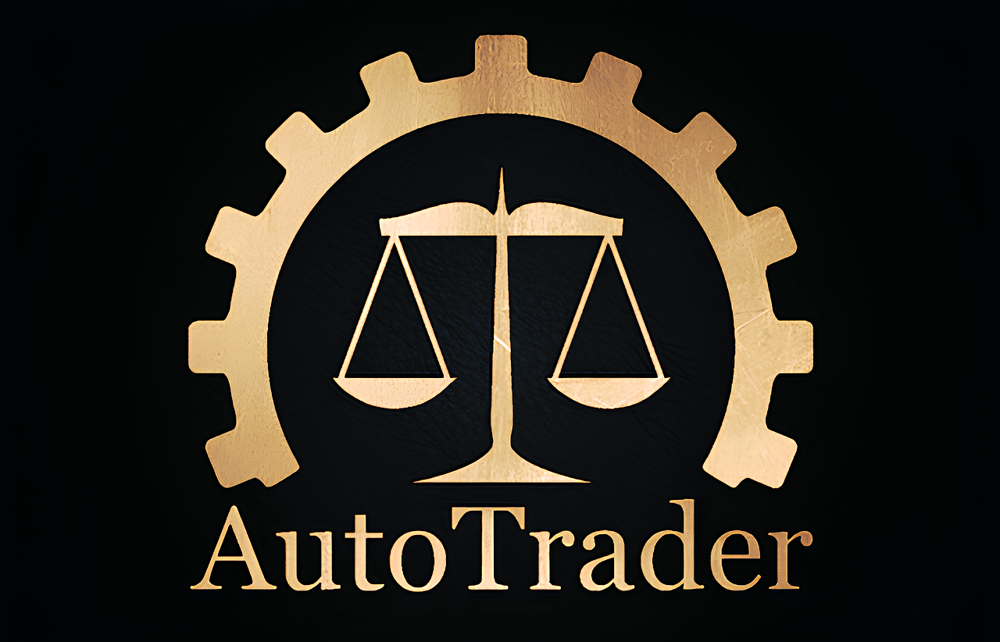

# Bannerlord AutoTrader

This is the repository for the AutoTrader mod for Mount & Blade II: Bannerlord.

## Installation

Download and install the mod using:
- [Steam Workshop](https://steamcommunity.com/sharedfiles/filedetails/?id=2875660601)
- [Nexusmods](https://www.nexusmods.com/mountandblade2bannerlord/mods/135)

Or build from source (see [Contributing](#contributing) below).

## Contributing

Contributions are welcome! Please see [CONTRIBUTING.md](CONTRIBUTING.md) for detailed setup instructions.

**Quick Start:**

1. Clone this repository
2. Copy `AutoTrader/paths.props.user.template` to `AutoTrader/paths.props.user`
3. Edit `paths.props.user` and set your Bannerlord installation path
4. You are ready to build!

## License

MIT License - see [LICENSE.txt](LICENSE.txt) for details.